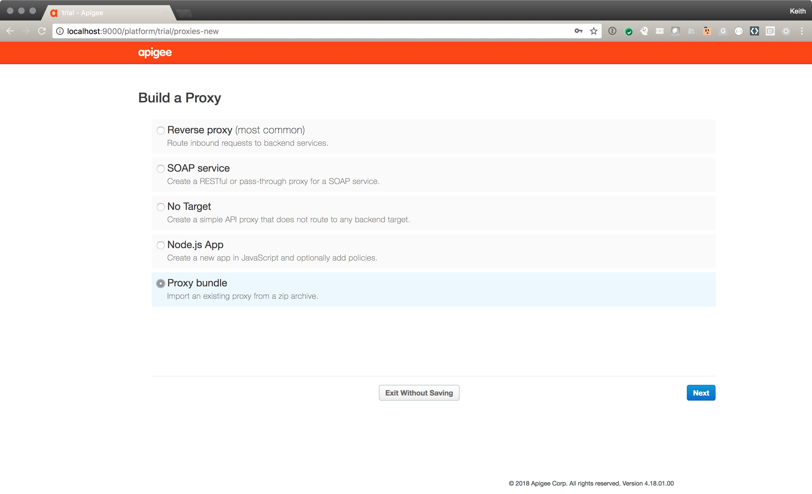

# Example of how to build a composite API in Apigee Edge

This Apigee Edge API Proxy demonstrates how to call two backend services and then build a new composite response. 

## Disclaimer

This example is not an official Google product, nor is it part of an official Google product.

## Notes

Zip up the apiproxy-bundle directory and then you can import it into Edge as a new proxy

#Steps:

Create a new proxy using the Proxy Bundle option

Upload the bundle

Deploy the new proxy

## License

This material is Copyright 2018 Google Inc. and is licensed under the [Apache 2.0
License](LICENSE). This includes the the API Proxy configuration as well as tools and libraries.